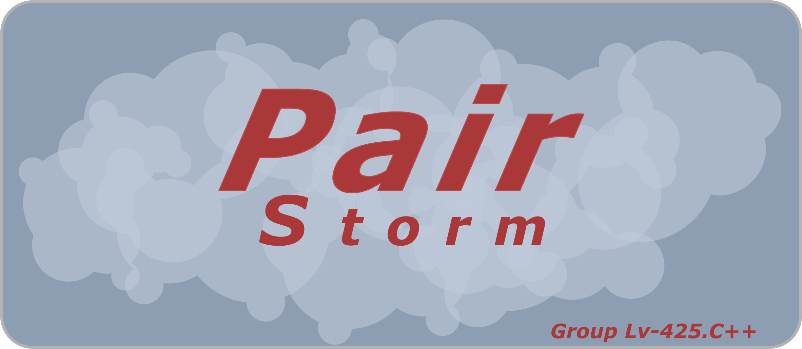

:cloud: Pair Storm IDE :cloud:
==============================

 

 

Pair Storm is a project oriented integrated development environment, which based on conception of pair programming. The software contains many useful features, which aim to help programmers to write good and clearly code. About them you can read below. Also Pair Storm helps to organize coworking between two or more programmer. To reaching these goal in the program were added many modules, which help to communicate, share code etc. IDE was created by group LV-425.C++ of the SoftServe IT Academy. 

:two_men_holding_hands: User-Friendly Interface :two_men_holding_hands:
======================================================================

Interface of Pair Storm is pretty simple. If you were using integrated development environment like Visual Studio, Qt Creator, CLion and etc before, work with Pair Storm will not be a problem for you. The most used tools is always in sight. If you want access to advanced settings use the relevant menu.
 
:speech_balloon: Embedded Chat :speech_balloon:
===============================================

Pair Storm IDE has embedded chat. It helps to communicate with another programmers during development process. In chat can hang out many users at the same time. All messages are saving in local database, which is unique for each project. Embedded chat is secure. Get access to the message history can only authorized users, which work have appropriate premissions.

:hammer: Refactoring Tools :hammer:
===================================

IDE gives users many useful tools, which make development process easier and faster. For example, Pair Storm has embedded class generator. Using it programmer can create .h and .cpp files, define new methods in both file and etc. 

Also Pair Storm have many useful features, which help programmer to write good code: auto tabulation, auto completion and etc.

:high_brightness: Syntax Highlighting :high_brightness:
=======================================================

Embedded code editor displays text in different colors. This helps to make source code more readable, simple for comprehension. Also highlighter recognize invalid construction. This lets find mistakes errors in source code and fix them before compilation.

:heavy_plus_sign: Comments :heavy_plus_sign:
============================================

Pair Storm supports comments in Github style. This helps to realize conception of pair programing, when one person write source code and another - review it right away. All comments are saving in local database, which is unique for each project. User can write comments to either line of code.

:wrench: Settings :wrench:
==========================

With the help of settings menu user can customize IDE in conformity with its own wishes. For example, Pair Storm supports couple styles. Using settings window user can switch between them.

